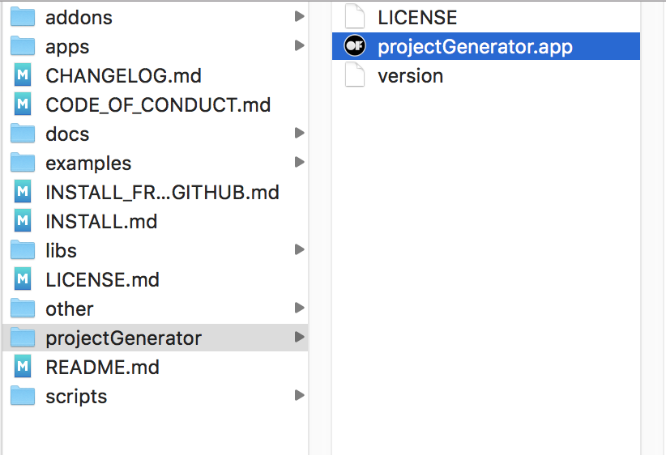
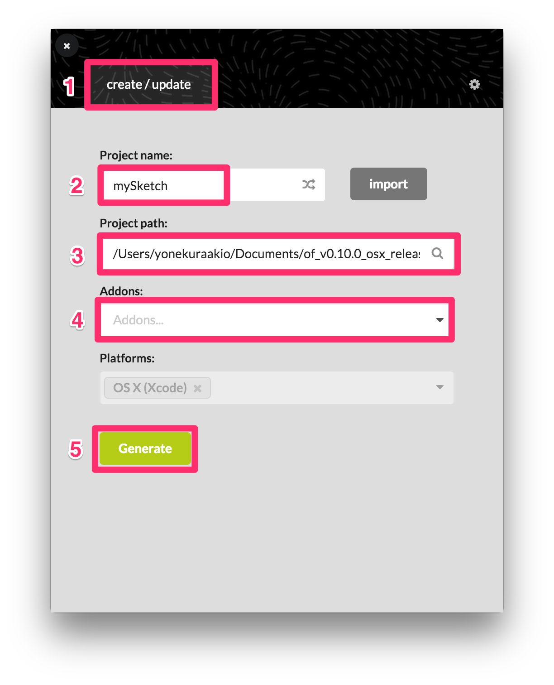
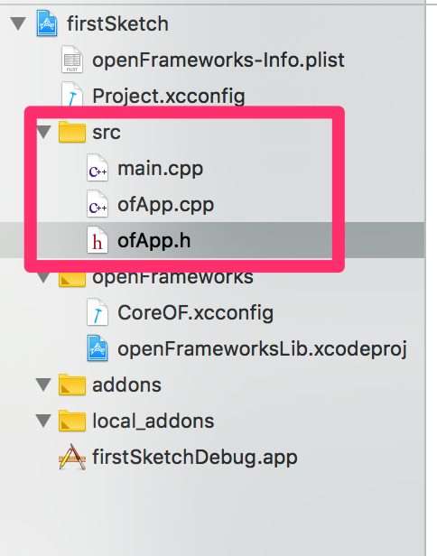

# Xcodeによるプロジェクト作成

## projectGenerator

of_v0.10.0_osx_releaseフォルダのprojectGeneratorフォルダから
projectGenerator.appを開く

&nbsp;

1. createをクリック
2. プロジェクト名を記入
3. 保存場所を決める
4. アドオンを使う場合選ぶ（不要な場合は空欄）
5. プロジェクト生成..... 自動でXcodeが立ち上がる

&nbsp;

## Xcodeのファイル構成

srcフォルダの中を使う

* main.cpp  大元のファイルだが、今の所使わない
* ofApp.h  ヘッダファイル。グローバル変数や関数を登録しておく
* ofApp.cpp  コードを記述
* addonsフォルダ　アドオンを自分で追加する場合このフォルダに入れる

&nbsp;

