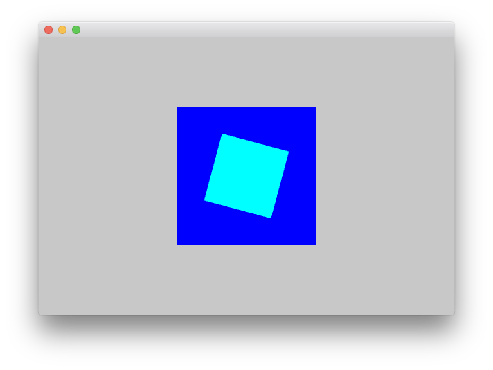

# 06 座標変換

## 原点の移動 ofTranslate

`ofTranslate(ofGetWidth()/2, ofGetHeight()/2);`

座標の基点を中心に


&nbsp;


## 拡大

* ofScale(x,y);

`ofScale(2,2);`


&nbsp;


## 回転

#### 2D

* ofRotateDeg();
* ofRotateRad();


#### 3D

* ofRotateXDeg()
* ofRotateYDeg()

&nbsp;


## 座標保存

### ofPushMatrix

座標の保存

### ofPopMatrix

座標を元に戻す
&nbsp;
&nbsp;


### 回転アニメーションと静止

```
#include "ofApp.h"

//角度
float angle = 0.0;

//--------------------------------------------------------------
void ofApp::setup(){
    ofSetWindowShape(600, 400);
    ofSetRectMode(OF_RECTMODE_CENTER); //四角形の基点
}

//--------------------------------------------------------------
void ofApp::update(){
    angle += 1;
    
    if(angle > 360){
        angle = 0;
    }
}

//--------------------------------------------------------------
void ofApp::draw(){
    
    ofSetColor(0, 0, 255);
    ofDrawRectangle(ofGetWidth()/2, ofGetHeight()/2, 200, 200);
    
    
    
    ofPushMatrix();
    ofTranslate(ofGetWidth()/2, ofGetHeight()/2);
    
    ofRotateDeg(angle);
    ofSetColor(0, 255, 255);
    ofDrawRectangle(0, 0, 100, 100);
    ofPopMatrix();
    
}
```


&nbsp;
&nbsp;
&nbsp;
&nbsp;

