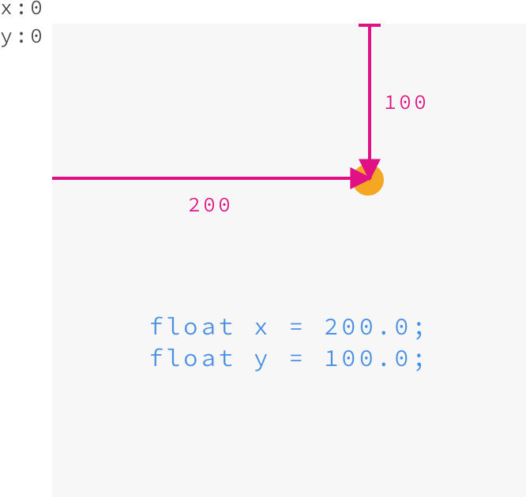
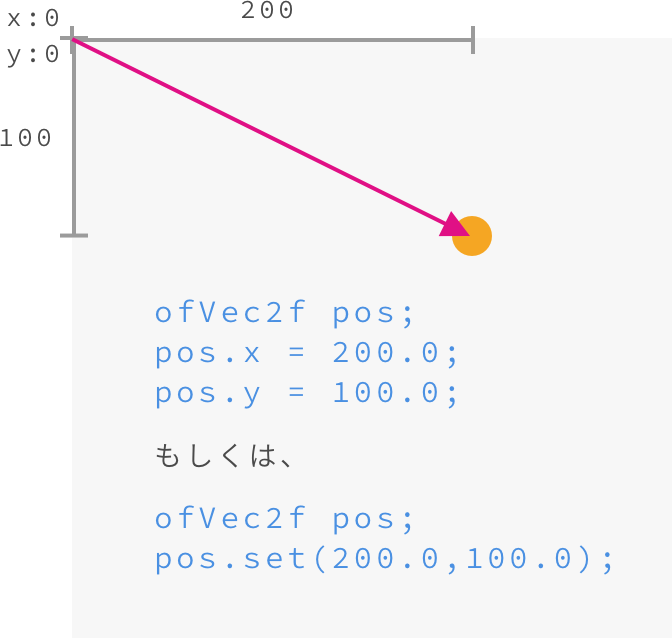
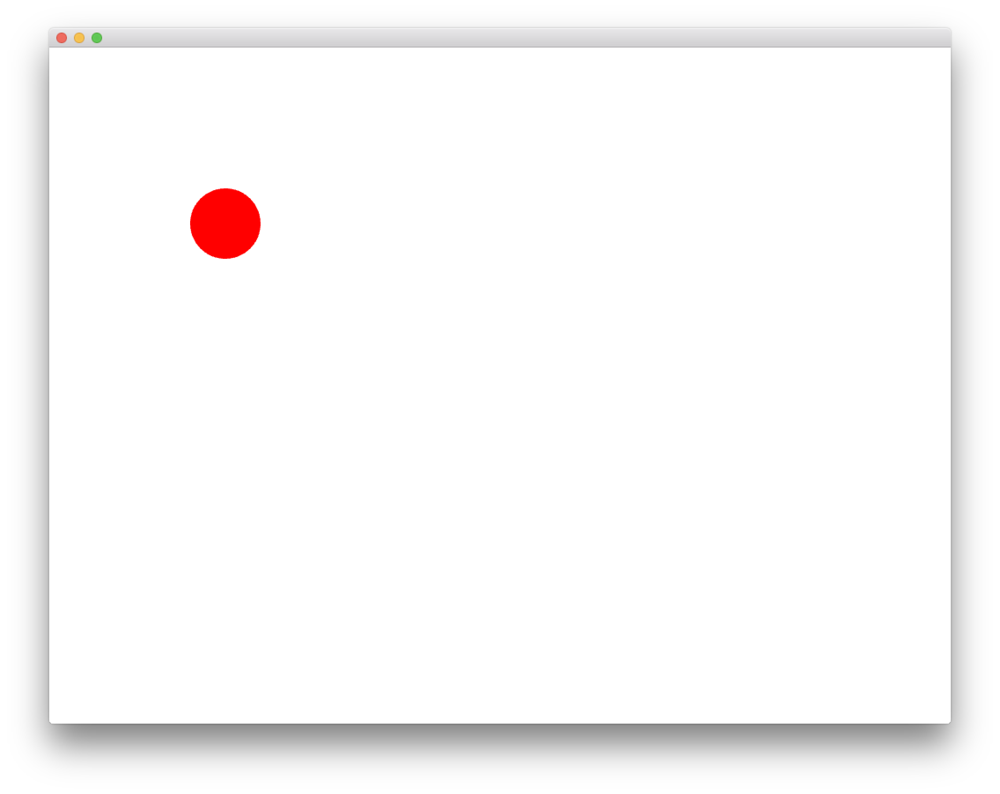

# 07 ベクトル


## ofVec2f
X座標とY座標を同時に格納するオブジェクト

```
ofVec2f pos; //ベクトル型変数の宣言
pos.x = 10.0;
pos.y = 20.0;

// もしくは、
// pos.set(10.0, 20.0);

```

### X座標 / Y座標による座標系

&nbsp;



&nbsp;


### ベクトルによる座標系

&nbsp;



&nbsp;

## ベクトル演算
### ベクトルの加算/減算/乗算/除算
```
ofVec2f p1, p2;
p1.set(2,4);
p2.set(4,8);

p1 += p2; //ベクトルの加算
p1 -= p2; //ベクトルの減算
p1 *= p2; //ベクトルの乗算
p1 /= p2; //ベクトルの除算

```

### ベクトルの大きさ 
`length()`

```
ofVec2f p1, p2;
p1.set(2,4);
p2.set(4,8);

float m = p1.length(); //ベクトルの大きさ


```

&nbsp;

### ベクトルを使わないアニメーション

```
// ofApp.h

// 円の座標
float posX;
float posY;

// 円の目的地
float targetX;
float targetY;

// イージング
float easing = 0.1;

```

```
//ofApp.cpp

void ofApp::setup(){
	// 背景色
	ofBackground(0, 0, 0);
	    
	// 円の角の数
	ofSetCircleResolution(64);
	
	// 円の初期値
	posX = 0.0;
	posY = 0.0;
	
	// 円の目的地
	targetX = 200.0;
	targetY = 200.0;
}


void ofApp::update(){
	// 円の位置の更新
	posX = posX + (targetX - posX) * easing;
	posX = posY + (targetX - posY) * easing;
    
}

void ofApp::draw(){
	ofSetColor(255, 0, 0);
	ofDrawCircle(posX, posX, 40);
}

```



&nbsp;

&nbsp;

### ベクトルを使ったアニメーション

```
// ofApp

// 円の座標（ベクトル）
ofVec2f pos;

// 円の目的座標（ベクトル）
ofVec2f targetPos;


```

```
//ofApp.cpp

void ofApp::setup(){
	// 背景色
	ofBackground(0, 0, 0);
	    
	// 円の角の数
	ofSetCircleResolution(64);
		
	// 円の初期値をセット
	pos.set(0.0, 0.0);
	
	// 円の目的地をセット
	targetPos.set(200.0, 200.0);  
}


void ofApp::update(){
    
	// 円の位置の更新　ベクトルで計算
	pos = pos + (targetPos - pos) * easing;
    
}

void ofApp::draw(){
	    
	ofSetColor(255, 0, 0);
	ofDrawCircle(pos.x, pos.y, 40);

}

```
&nbsp;


## ofVec3f
X座標,Y座標,Z座標を同時に格納するオブジェクト

```
ofVec3f pos; //ベクトル型変数の宣言

pos.x = 1.0;
pos.y = 2.0;
pos.z = -1.0;

```

&nbsp;