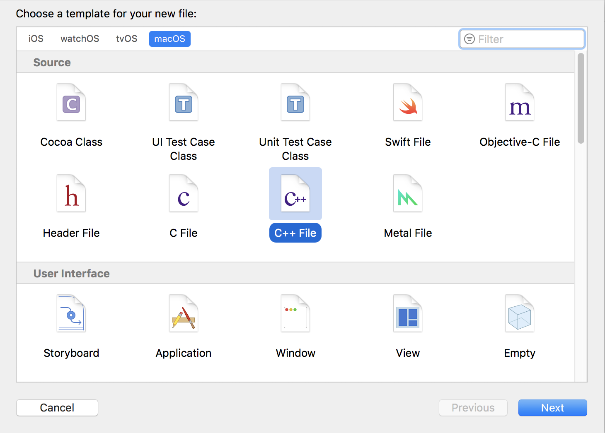
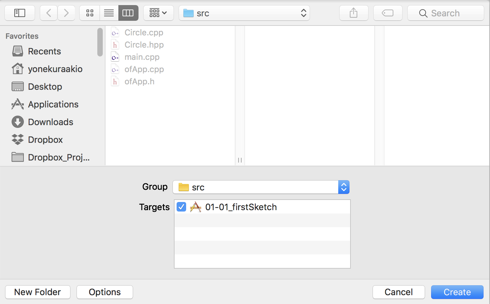

# クラス


## 新規クラスの作成

File > New > File 

macOSの`C++ File`を選択




Nameにクラスの名前を記述（先頭を大文字にする）


 srcフォルダに保存、クラス名のヘッダファイル（hpp）とメインファイル（cpp）ファイルが出来上がる




&nbsp;

### クラス::ヘッダファイル

```
// Circle.hpp

#pragma once //繰り返しロードしないようにガードする
#include "ofMain.h" //oFの機能を使えるようにインクルード

#ifndef Circle_hpp
#define Circle_hpp

#include <stdio.h>

// ファイル名と同じ命名をする
class Circle{
    
public:
	// コンストラクタの記述
   Circle(); 
    
   // メソッド ------------------
   void update();
   void draw();
   
   // プロパティ ------------------ 
   // 座標
   ofVec2f pos;
    
   // 半径
   float radius;
    
   // スピード
   ofVec2f speed;
    
}; //最後にセミコロンが必要

#endif /* Circle_hpp */

```

&nbsp;

### クラス::メインソース

```
// Circle.cpp
#include "Circle.hpp"

//コンストラクタ　最初に呼ばれる関数 --------------------------
Circle::Circle(){
    //座標　半径　スピードの初期化
    pos.set(ofRandom(ofGetWidth()), ofRandom(ofGetHeight()));
    radius = ofRandom(2,10);
    speed.set(ofRandom(-5,5),ofRandom(-5,5));
}

void Circle::update(){
    // 現在地にスピードを足す 
    pos = pos + speed;
    if(pos.x > ofGetWidth() || pos.x < 0){
        speed.x = -1 * speed.x;
    }
    if(pos.y > ofGetHeight() || pos.y < 0){
        speed.y = -1 * speed.y;
    }
}

void Circle::draw(){
    ofSetColor(255, 0, 0);
     // 円形
    ofSetCircleResolution(64);
    ofDrawCircle(pos.x, pos.y, radius);
}

```

&nbsp;


### ofAppヘッダファイルにインスタンスを変数の登録

```
// ofApp.h
#pragma once

#include "ofMain.h"
#include "Circle.hpp" //クラスのヘッダファイルをインクルード

class ofApp : public ofBaseApp{
    
public:
    void setup();
    void update();
    void draw();
    
	//インスタンス用の変数
   Circle* circle;
};
```

&nbsp;


### ofApp.cppのインスタンスの生成

```
// ofApp.cpp
#include "ofApp.h"

void ofApp::setup(){
    ofBackground(255, 255, 255);
    
    // インスタンスの生成 
    circle = new Circle();
}

void ofApp::update(){
    // 現在地にスピードを足す
    circle->update(); //アロー関数でメソッドを呼ぶ
}

void ofApp::draw(){
    circle->draw();
}

```


