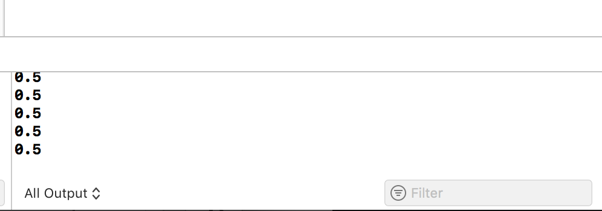
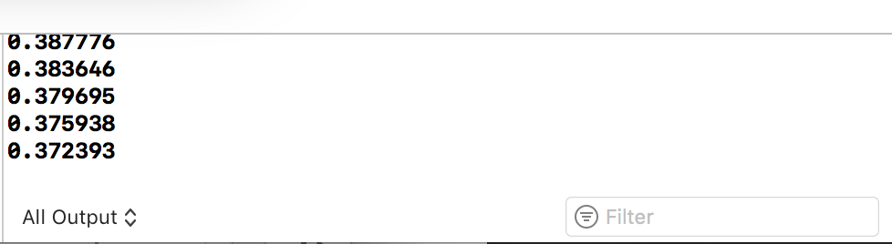
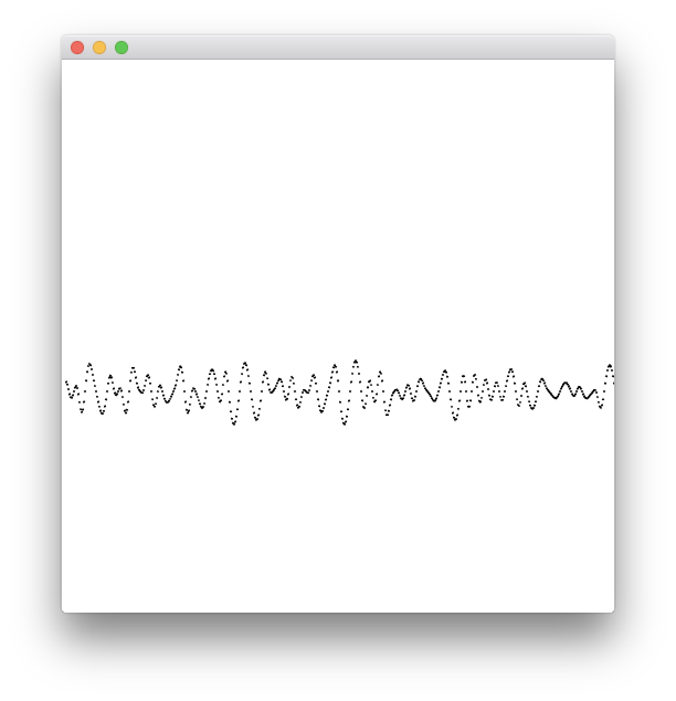
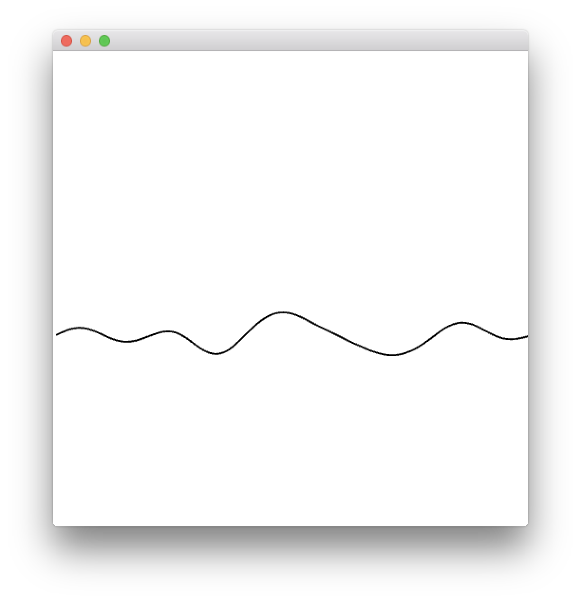
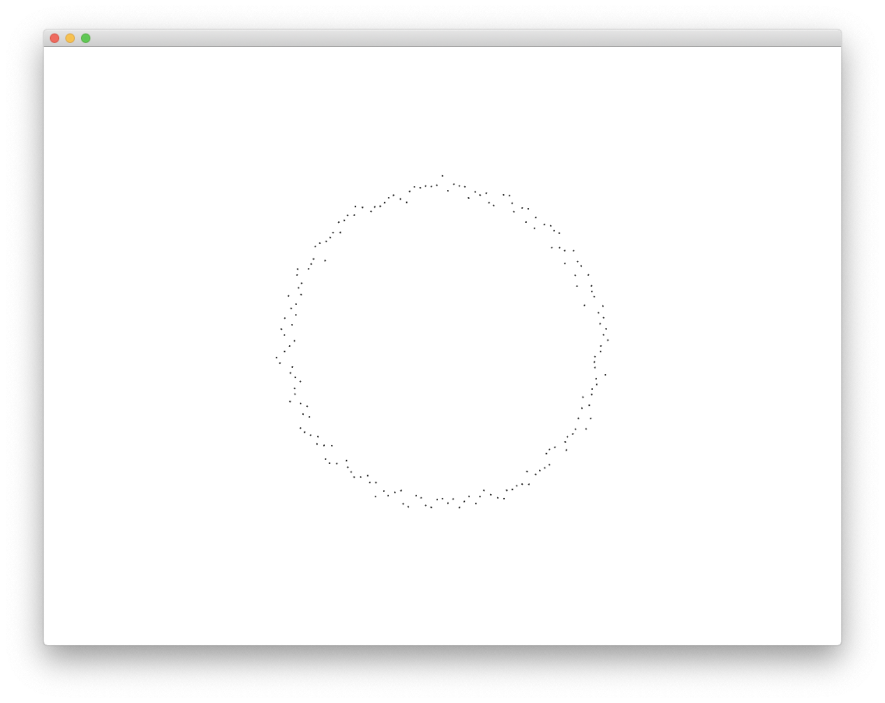

# ノイズ 

自然物を表現するときのテクスチャや地形描写などで使われる


## ofNoise()

パーリンノイズの生成に使う。引数に数値を与えると0.0 から1.0 の間の数値（float）を返す。

`ofNoise(time);`

&nbsp;
&nbsp;

## サンプルコード1
```
float time = 3; //時間 

void ofApp::update(){
	//ノイズ関数から出力された値 
    float n = ofNoise(time);
    cout << n << endl;
}

```




出力結果は0.5のみになる

&nbsp;
&nbsp;

## サンプルコード2
```
float time = 3; //時間 

void ofApp::update(){
	//ノイズ関数から出力された値 
    float n = ofNoise(time);
    time += 0.01; //時間の値をインクリメント
    cout << n << endl;
}

```



出力結果が変動していく

&nbsp;
&nbsp;

## サンプルコード3
インクリメントの値が大きいとノイズの値が大きく揺れる

```
float time = 3; //時間 
ofVec2f pos;

void ofApp::setup(){
    ofBackground(255);
    ofSetBackgroundAuto(false);
    pos.set(0,0);
}
void ofApp::update(){
    float n = ofNoise(time);
    // y座標にノイズ乱数（100掛けたもの）を加える
    pos.y = n * 100;
    cout << n << endl;
    time += 0.1; //時間の増減
    pos.x += 1; //X座標は横移動
}
void ofApp::draw(){
	ofTranslate(0, ofGetHeight()/2);
	ofSetColor(0);
	ofDrawCircle(pos.x, pos.y, 1);
}

```



&nbsp;
&nbsp;

## サンプルコード4

インクリメントの値が小さいとノイズの値も滑らかになる。
ノイズ値は毎回同じ値を返すので、時間（t）の開始を変えれば異なる値を返す。

```
float time = 3; //時間　ここを変えると値が変化する 
ofVec2f pos;

void ofApp::setup(){
    ofBackground(255);
    ofSetBackgroundAuto(false);
    pos.set(0,0);
}
void ofApp::update(){
    float n = ofNoise(time);
    // y座標にノイズ乱数（100掛けたもの）を加える
    pos.y = n * 100;
    cout << n << endl;
    time += 0.01; //時間の増減
    pos.x += 1; //X座標は横移動
}
void ofApp::draw(){
    ofSetColor(0);
    ofDrawCircle(pos.x, pos.y, 1);
}

```




&nbsp;
&nbsp;

## サンプルコード5

ノイズの値を配列で扱う

```
//ofApp.h
#pragma once
#include "ofMain.h"

class ofApp : public ofBaseApp{
	public:
		void setup();
		void update();
		void draw();

    static const int NUM = 180;
    //座標
    ofVec2f pos[NUM];
    //半径
    float radius[NUM];
    //ノイズ時間
    float startTime[NUM];
};

```


```
//ofApp.cpp
#include "ofApp.h"

void ofApp::setup(){
    ofBackground(255);
    ofSetFrameRate(60);
    for (int i=0; i<NUM; i++) {
        radius[i] = 200.0; //半径の初期値
        startTime[i] = ofRandom(10000); //開始時間にランダム
        pos[i].x = radius[i] * cos(ofDegToRad(i * 2));
        pos[i].y = radius[i] * sin(ofDegToRad(i * 2));
    }
}

void ofApp::update(){
    for (int i=0; i<NUM; i++) {
    	//ノイズの値を0~1から-1~1に置き換える
        float n = ofNoise(startTime[i]) * 2 - 1;
        radius[i] = radius[i] + n; //半径に加える
        pos[i].x = radius[i] * cos(ofDegToRad(i * 2));
        pos[i].y = radius[i] * sin(ofDegToRad(i * 2));
        startTime[i] += 0.02;//時間をインクリメント
    }
}

void ofApp::draw(){
    ofSetColor(0);
    ofTranslate(ofGetWidth()/2,ofGetHeight()/2);
    for (int i=0; i<NUM; i++) {
        ofDrawCircle(pos[i].x, pos[i].y, 1);
    }
}
```

