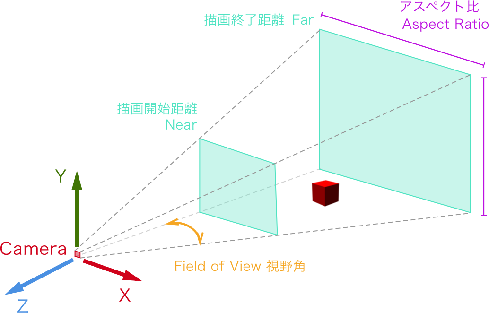

# 3D

## 図形 of3dGraphics

#### 立方体

`ofDrawBox(300, 300, 300, 100, 100, 100);`


#### 円錐
`ofDrawCone(300, 300, 100, 200);`


#### 球
`ofDrawSphere(float x, float y, float radius);`


#### 楕円
`ofDrawEllipse(float x, float y, float width, float height);`


&nbsp;


## of3dPrimitive 

* `ofBoxPrimitive`

* `ofSpherePrimitive`


```
//ofApp.h

//プリミティブ型の変数宣言
ofBoxPrimitive box;
ofVec3f boxPos;

```

```
//ofApp.cpp
void ofApp::setup(){
    
    ofBackground(255, 255, 255);
    // カメラの設定
    cam.setFov(80.0f);
    cam.setDistance(500);
    
    // 立方体の座標を指定
    boxPos.set(0,0,0);    
}

void ofApp::draw(){
   
    ofTranslate(ofGetWidth()/2, ofGetHeight()/2,0);
    cam.begin();
    
    // boxPrimitiveの描画
    ofSetColor(255, 0, 0); //カラー
    box.set(20); //サイズ
    box.setPosition(boxPos); //座標
    box.draw(); //描画
  
    cam.end();
}

```

&nbsp;


## カメラ ofEasyCam

宣言

```
//ofApp.h
ofEasyCam cam;

```

##### カメラ機能の開始と終了
draw()の中に

開始

`cam.begin();`

終了

`cam.end();`


#### カメラの視野角



fov (Field of View) 視野角 60~90度が多い

`cam.setFov(80.0f);`

#### カメラとの距離

`cam.setDistance(100);`


#### カメラの位置
`cam.setPosition(100,100,100);`

#### カメラが見る対象物を設定
`cam.setTarget(model.getPosition());`

&nbsp;

```
//ofApp.h
ofEasyCam cam; //カメラ
ofBoxPrimitive box; //立方体 

```

```
//ofApp.cpp

void ofApp::setup(){
    ofSetFrameRate(60);
    ofBackground(0, 0, 0);
    ofEnableDepthTest(); //深度テストを有効に
    
    // カメラ設定
    cam.setFov(80.0f);
    cam.setPosition(100,100,100);
}


void ofApp::draw(){
    cam.begin();  //カメラ起動
    
    ofSetColor(255, 0, 150); //カラー
    box.set(20); //立方体の大きさ(20,20,20);
    box.setPosition(0,0,0);
    // box.draw();
    
    box.setResolution(10); //数値が大きいほど立方体を構成するメッシュの数が増える
    box.drawWireframe();  //立方体のフレームを描画
    
    
    cam.setTarget(box.getPosition()); //カメラの向き
    cam.end();  //カメラ終了
    
}
```

&nbsp;

## ライト ofLight

light の種類


* PointLight 点光源
 * 全方位に発光する。電球に近い。 	
* SpotLight スポットライト光源
 * 1点に向けて光を当てる光源、スポットライトにより影が出来る。 
* AmbientLight 環境光源
	* 全体を明るくする。影はつかずオブジェクトの面は全て同じ色になり陰影は出ない。 	
* DirectionalLight 平行光源
	* シーン全体に降り注ぐ光、太陽光に近い。


```
//ofApp.h

//ライトの機能
ofLight light;

```


```
//ofApp.cpp

void ofApp::setup(){
    ofBackground(255, 255, 255);
    
    ofEnableDepthTest();//深度
    
    //カメラ
    cam.setFov(80.0f);
    cam.setPosition(100,100,100);

    light.enable(); //ライトを有効
    light.setPointLight(); //ポイントライトを配置
    light.setPosition(0, 500, 500); //ライトの位置
    
    //環境反射光
    light.setAmbientColor(ofFloatColor(0.5,0.2,0.2,1.0));
    //拡散反射光
    light.setDiffuseColor(ofFloatColor(0.5,0.5,1.0));
    //鏡面反射光
    light.setSpecularColor(ofFloatColor(1.0,1.0,1.0));
}

void ofApp::draw(){
	light.enable();
	box.set(15);
	box.setPosition(0,0,0);
	material.begin();
	box.draw();
	material.end();
	light.disable();
}
```

&nbsp;


## マテリアル ofMaterial

マテリアルは反射の色を表す

#### Specular 反射光
光源から放射された光が、物体の表面で反射したときの色｡ 
`material.setSpecularColor(ofFloatColor(0,1.0,0));`	
#### Diffuse 拡散光
光源から放射された光が、物体に当たって拡散（乱反射）されるときの色
`material.setDiffuseColor(ofFloatColor::green);`

#### Ambient 環境光
光源からの環境光が物体に当たって拡散されたときの色
`material.setAmbientColor(ofFloatColor(0,1.0,0));`

#### Emissive 放射光
物体が自ら放射している光の色
`material.setEmissiveColor(ofFloatColor(0,1.0,0));`


```
//ofApp.h

ofMaterial material;
ofLight light;

```


```
//ofApp.cpp

void ofApp::setup(){
	ofDisableDepthTest(); //階層を最適化
	material.setEmissiveColor(ofFloatColor(0,1.0,0));
	light.setPointLight();
	light.setPosition(0, 0, 500);
}

void ofApp::draw(){
	light.enable();
	box.set(15);
	box.setPosition(0,0,0);
	material.begin();
	box.draw();
	material.end();
	light.disable();
}
```

&nbsp;

## ヘルパー


#### XYZ軸
`ofDrawAxis(1000);`

#### XYZ回転
`ofDrawRotationAxes(200,1,60);`


#### グリッド（カスタム）

```
//ofApp.h
void gridHelper(int size, int step);
```

```
//ofApp.cpp
void ofApp::gridHelper(int size, int step){
    ofSetColor(0,20);
    for (int i=0; i<size; i+=step) {
        ofDrawLine(i-size/2, 0, size/2, i-size/2, 0, -size/2);
        ofDrawLine(-size/2, 0, i-size/2, size/2, 0, i-size/2);
    }
}
```