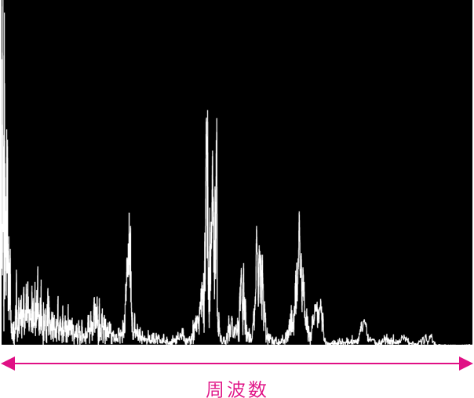
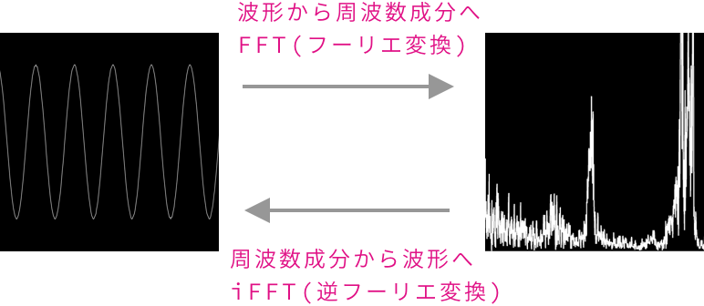
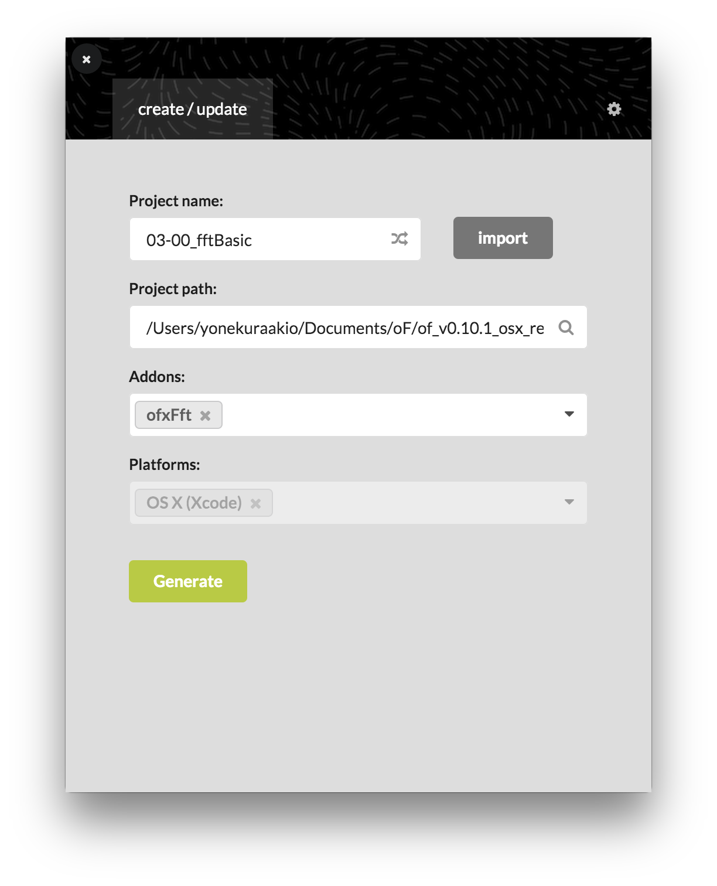

# FFT

---

## フーリエ変換

19世紀フランスの数学者・物理学者のジョゼフ・フーリエに由来する周波数変換


[フーリエ変換を宇宙一わかりやすく解説してみる](https://www.yukisako.xyz/entry/fourier-transform?fbclid=IwAR2LO11wfY1mKQqiqESLoO3kYPoBwLT9c-Bqx-2CQQJRDZxizw-NLNw_JGs)


&nbsp;
&nbsp;


## FFTによる音の周波数解析

### 音の波形


&nbsp;
&nbsp;


### 周波数解析



&nbsp;
&nbsp;


### FFTによる周波数




&nbsp;
&nbsp;


----

# ofxFft

[Kyle Mcdonald](https://kylemcdonald.net/)によるoFアドオン。音の周波数解析を行う。

[ofxFftダウンロード](https://github.com/kylemcdonald/ofxFft)


* Githubからダウンロードして、`addon`に追加
* ProjectGeneratorから`addon`で`ofxFft`を選択
* `Generate`ボタンでプロジェクトを起動



&nbsp;

### 追加ファイル　FFTWを使う場合は

[precompiled libraries.](https://github.com/downloads/kylemcdonald/ofxFft/fftw-libs.zip)

`osx`フォルダと`win32`フォルダを`addons/ofxFft/libs/fftw/lib/`に置く


&nbsp;
&nbsp;


## ofxEasyFft

周波数ごとの成分が0.0～1.0 の範囲で取得できる


```
// ofApp.h

#pragma once
#include "ofMain.h"
#include "ofxEasyFft.h" //インクルード

class ofApp : public ofBaseApp{
	public:
		void setup();
		void update();
		void draw();
		
    //FFTのクラスを呼び出す変数
    ofxEasyFft fft;
};

```


```
//ofApp.opp
void ofApp::setup(){
    ofSetFrameRate(60);
    ofBackground(0);
    
    //FFTのセットアップ
    fft.setup(1024);
}


void ofApp::update(){
    fft.update(); //FFT更新
}


void ofApp::draw(){
	//動的配列bufferを作り周波数ごとの値を保存
    vector<float> buffer;
    buffer = fft.getBins();//fftの値をbufferに保存
    ofNoFill();
    
    // fftの値を線で表現
    ofSetLineWidth(2);
    ofBeginShape();
    for (int i=0; i<buffer.size(); i++) {
        float x = ofMap(i, 0, buffer.size(), 0, ofGetWidth());
        float y = ofMap(buffer[i],0,1,ofGetHeight(),0);
        ofVertex(x, y);
    }
    ofEndShape();
}
```

&nbsp;
&nbsp;


## ofxProcessFFT

音の低域・中域・高域に分けて取得できる

[oF のアドオン ofxFft が正常に動かなかった話](https://qiita.com/almina-orange/items/13e2c467a3cd226761f9)


```
#pragma once

#include "ofMain.h"
#include "ofxProcessFFT.h" //インクルード

class ofApp : public ofBaseApp{

	public:
		void setup();
		void update();
		void draw();

	//ofxProcessFFT用の変数
    ProcessFFT fft;
    
    
    //低域・中域・高域の値を保存する変数
    float lowVal;
    float midVal;
    float highVal;

};

```


```
#include "ofApp.h"
//--------------------------------------------------------------
void ofApp::setup(){
    ofBackground(0, 0, 0);
    ofSetFrameRate(60);
    fft.setup();
    fft.setNumFFTBins(16); 
    fft.setNormalize(true); //正規化
    ofSetCircleResolution(64);
}

//--------------------------------------------------------------
void ofApp::update(){
    fft.update();
    
    // 低域・中域・高域の値を保存
    lowVal = fft.getLowVal();
    midVal = fft.getMidVal();
    highVal = fft.getHighVal();

    cout << "lowVal: "<< lowVal << endl;
    cout << "midVal: "<< midVal << endl;
    cout << "highVal: "<< highVal << endl;
}

//--------------------------------------------------------------
void ofApp::draw(){

	//ヘルパー
    fft.drawBars();
    fft.drawDebug();

    ofSetColor(255, 0, 0);
    float lowRadius = ofMap(lowVal, 0, 1, 10, 200);
    ofDrawCircle(200, ofGetHeight()/2, lowRadius);

    ofSetColor(0, 255, 0);
    float midRadius = ofMap(midVal, 0, 1, 10, 200);
    ofDrawCircle(ofGetWidth()/2, ofGetHeight()/2, midRadius);

    ofSetColor(0, 0, 255);
    float highRadius = ofMap(highVal, 0, 1, 10, 200);
    ofDrawCircle(ofGetWidth()-200, ofGetHeight()/2, highRadius);

}

//--------------------------------------------------------------


```