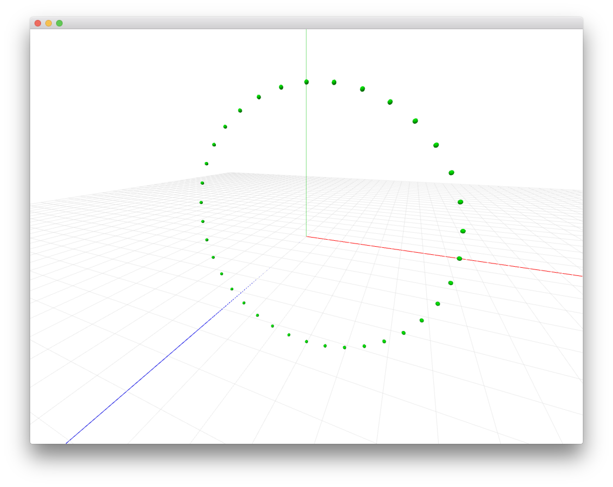
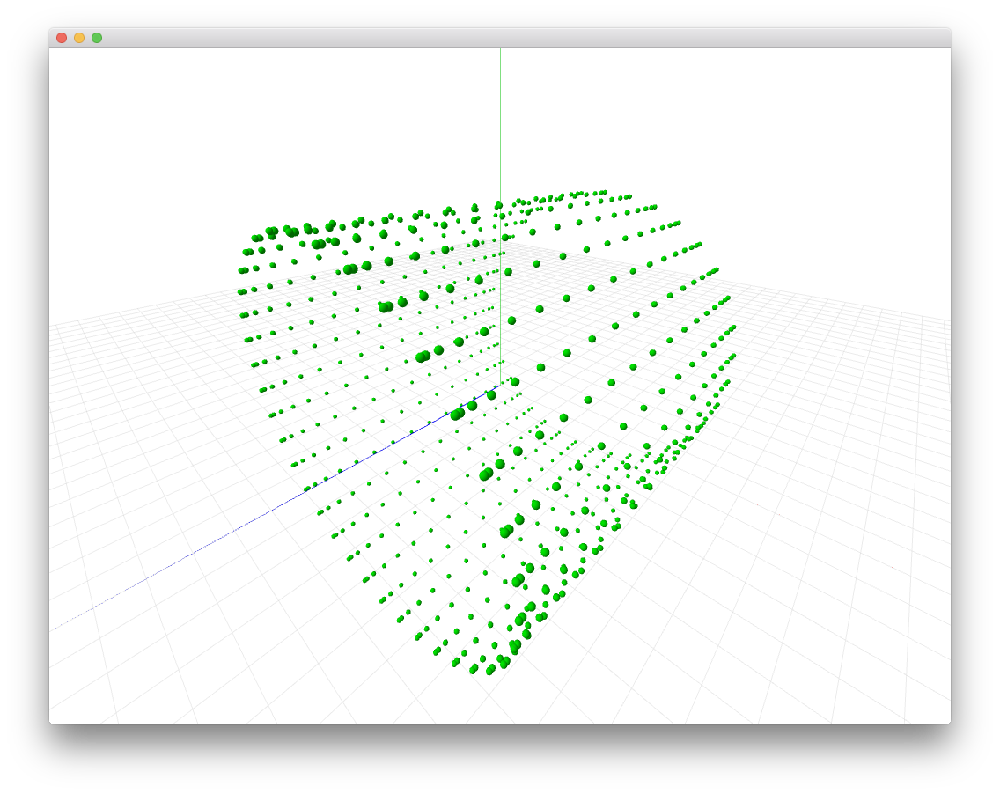
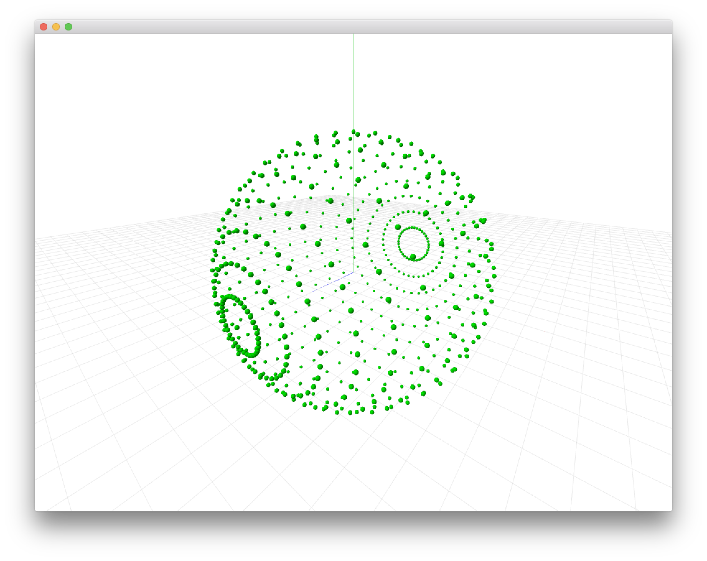
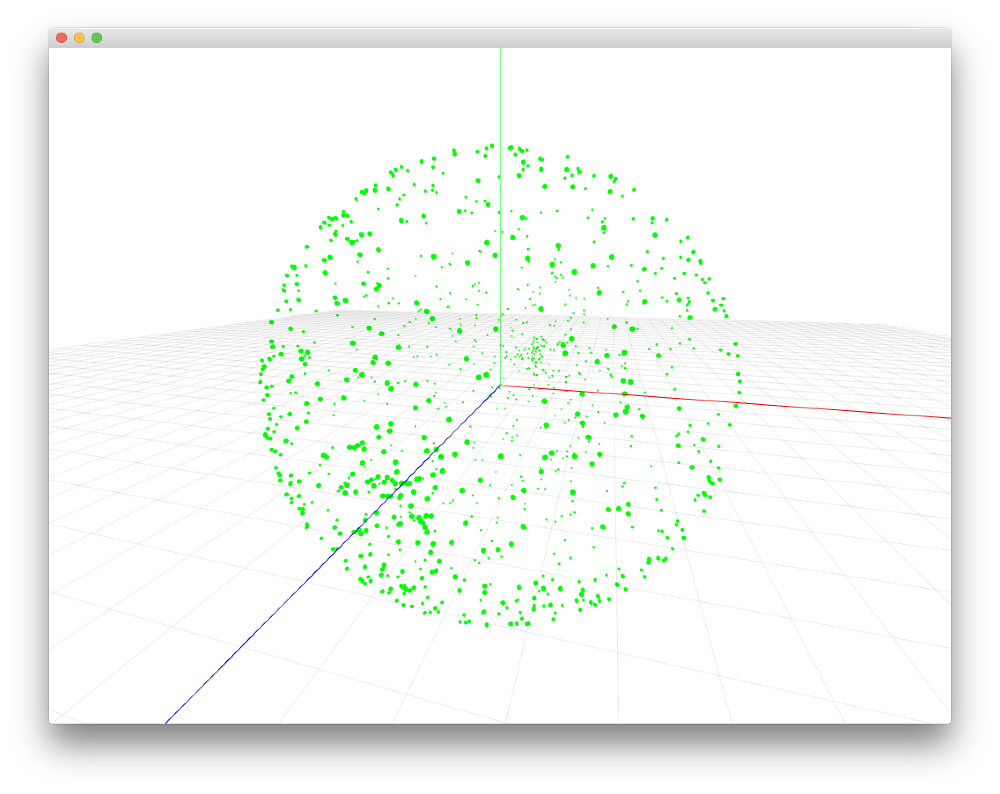
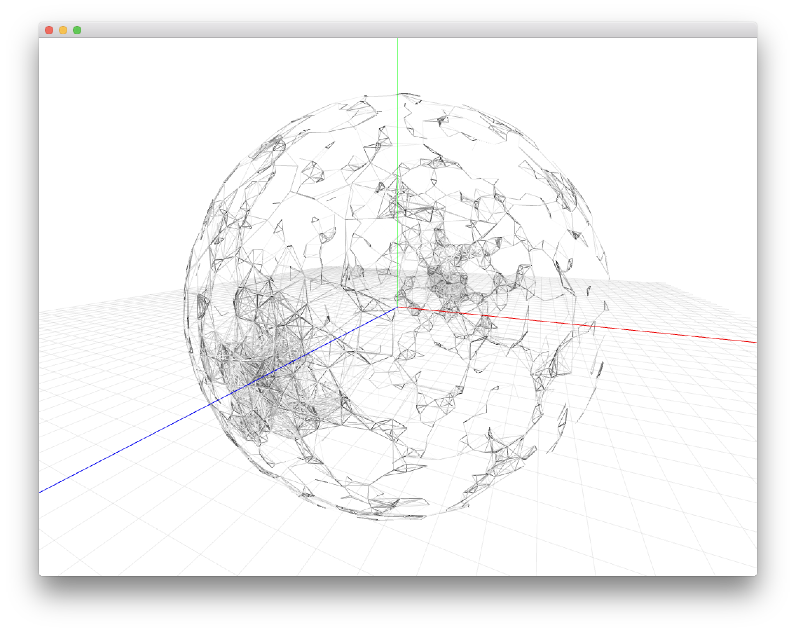

# 球体

## 円弧から球体

### XY軸



ヘッダファイル

```
//ofApp.h
#pragma once
#include "ofMain.h"
class ofApp : public ofBaseApp{

	public:
		void setup();
		void update();
		void draw();
    
    //3D用カメラ
    ofEasyCam cam;
    //ライト
    ofLight light;
    
    //球体の半径
    float radius = 200.0;
};
```

メインソース

```
//ofApp.cpp
#include "ofApp.h"
void ofApp::setup(){
    ofSetFrameRate(60);
    ofBackground(255, 255, 255);
    
    ofEnableDepthTest();//深度
    
    //カメラ
    cam.setFov(80.0f);
    cam.setPosition(100,100,100);
    
    //ライト
    light.enable(); //ライトを有効
    light.setPointLight(); //ポイントライトを配置
    light.setPosition(0, 500, 500); //ライトの位置
}

void ofApp::draw(){
    ofTranslate(ofGetWidth()/2, ofGetHeight()/2);
    cam.begin();
    
    // Y軸回転
    ofRotateYRad(ofGetFrameNum() * 0.005);
       
    // XY 球体を並べる
    for (int i=0; i<360; i+=10) {
        ofVec3f pos;
        pos.x = radius * cos(ofDegToRad(i));
        pos.y = radius * sin(ofDegToRad(i));
        pos.z = 0;
        ofSetColor(0, 255, 0);
        ofDrawSphere(pos.x, pos.y, pos.z, 2);
    }
    
    
    //3Dガイド
    gridHelper(1000, 20);
    ofDrawAxis(1000);
    cam.end();
}
```


### XYZ軸



メインソース


```
//ofApp.cpp
#include "ofApp.h"
void ofApp::setup(){
    ofSetFrameRate(60);
    ofBackground(255, 255, 255);
    
    ofEnableDepthTest();//深度
    
    //カメラ
    cam.setFov(80.0f);
    cam.setPosition(100,100,100);
    
    //ライト
    light.enable(); //ライトを有効
    light.setPointLight(); //ポイントライトを配置
    light.setPosition(0, 500, 500); //ライトの位置
}

void ofApp::draw(){
    ofTranslate(ofGetWidth()/2, ofGetHeight()/2);
    cam.begin();
    
    ofPushMatrix();   
    // XYZ 球体を並べる
    for(int j=0; j<180; j+=10){
        ofVec3f pos;
        pos.z = radius * cos(ofDegToRad(j));
        for (int i=0; i<360; i+=10) {
            pos.x = radius * cos(ofDegToRad(i));
            pos.y = radius * sin(ofDegToRad(i));
            ofSetColor(0, 255, 0);
            ofDrawSphere(pos.x, pos.y, pos.z, 2);
        }
    }    
    ofPopMatrix();
    
    //3Dガイド
    gridHelper(1000, 20);
    ofDrawAxis(1000);
    cam.end();
}
```

### XYZ軸と半径




メインソース


```
//ofApp.cpp
#include "ofApp.h"
void ofApp::setup(){
    ofSetFrameRate(60);
    ofBackground(255, 255, 255);
    
    ofEnableDepthTest();//深度
    
    //カメラ
    cam.setFov(80.0f);
    cam.setPosition(100,100,100);
    
    //ライト
    light.enable(); //ライトを有効
    light.setPointLight(); //ポイントライトを配置
    light.setPosition(0, 500, 500); //ライトの位置
}

void ofApp::draw(){
    ofTranslate(ofGetWidth()/2, ofGetHeight()/2);
    cam.begin();
    
    // Y軸回転
    ofRotateYRad(ofGetFrameNum() * 0.005);
    
    for(int j=0; j<180; j+=10){
        ofVec3f pos;
        pos.z = radius * cos(ofDegToRad(j));
        float r = radius * sin(ofDegToRad(j));
        for(int i=0; i<360; i+=10){
            
            pos.x = r * cos(ofDegToRad(i));
            pos.y = r * sin(ofDegToRad(i));
            ofSetColor(0, 255, 0);
            ofDrawSphere(pos.x, pos.y, pos.z, 2);
        }
    }
    
    //3Dガイド
    gridHelper(1000, 20);
    ofDrawAxis(1000);
    cam.end();
}
```

&nbsp;


## 球面座標系

[球面座標系](https://ja.wikipedia.org/wiki/%E7%90%83%E9%9D%A2%E5%BA%A7%E6%A8%99%E7%B3%BB)


球面座標系の公式


&nbsp;

### 球面上にランダム配置



ヘッダファイル

```
//ofApp.h
#pragma once
#include "ofMain.h"
class ofApp : public ofBaseApp{

	public:
		void setup();
		void update();
		void draw();
		void gridHelper(int size, int step);
    
    //3D用カメラ
    ofEasyCam cam;

    //半径
    float radius = 200.0;
    //点の数
    static const int NUM = 1000;
    //座標
    ofVec3f pos[NUM];
};
```

メインソース

```
//ofApp.cpp
#include "ofApp.h"

void ofApp::setup(){
    ofBackground(255,255,255);
    //カメラ
    cam.setFov(80.0f);
    cam.setPosition(100,100,100);
    ofEnableDepthTest();//深度
    
    for (int i=0; i<NUM; i++) {
        //θとφのランダム
        float randTheta = ofRandom(360);
        float randPhi = ofRandom(180);
        //球面状のXYZ座標
        pos[i].x = radius * sin(ofDegToRad(randTheta)) * cos(ofDegToRad(randPhi));
        pos[i].y = radius * sin(ofDegToRad(randTheta)) * sin(ofDegToRad(randPhi));
        pos[i].z = radius * cos(ofDegToRad(randTheta));
    }
}

void ofApp::draw(){
    ofTranslate(ofGetWidth()/2, ofGetHeight()/2,0);
    cam.begin(); //カメラ起動
    
    for (int i=0; i<NUM; i++) {
        ofSetColor(0, 255, 0); //カラー
        ofDrawSphere(pos[i].x, pos[i].y,pos[i].z, 1);
    }
    
    //3Dガイドを表示
    ofDrawAxis(1000);
    gridHelper(1000,20);

    //カメラ終了
    cam.end();
    glDisable(GL_DEPTH_TEST);
}

```

&nbsp;
&nbsp;

### 球面上でアニメーション




PointSphereクラスヘッダファイル

```
//PointSphere.hpp
#pragma once
#ifndef PointSphere_hpp
#define PointSphere_hpp
#include <stdio.h>
#include "ofMain.h"

class PointSphere{
public:
    PointSphere();
    void setup();
    void update();
    void draw();
    ofVec3f pos; //座標
    ofVec3f targetPos; //目的地
    float radius; //半径
    float easing = 0.05; //イージング
};
#endif /* PointSphere_hpp */
```

&nbsp;

PointSphereクラス　メインソース

```
//PointSphere.cpp
#include "PointSphere.hpp"

PointSphere::PointSphere(){
    //初期座標
    pos.set(0,0,0);
    targetPos.set(0,0,0);
    radius = 300;
    // 座標をセットする
    setup();
}

void PointSphere::setup(){
    //球面上に配置するランダムな座標
    //θとφ角度でランダム
    float randTheta = ofRandom(360);
    float randPhi = ofRandom(180);
    //球面上のXYZ座標
    targetPos.x = radius * sin(ofDegToRad(randTheta)) * cos(ofDegToRad(randPhi));
    targetPos.y = radius * sin(ofDegToRad(randTheta)) * sin(ofDegToRad(randPhi));
    targetPos.z = radius * cos(ofDegToRad(randTheta));
}

void PointSphere::update(){
    //目的地までの座標
    ofVec3f distance;
    distance = targetPos - pos;
    pos = pos + distance * easing;
}

void PointSphere::draw(){
    //描画
    ofSetColor(255);
    ofDrawSphere(pos.x, pos.y,pos.z, 1);
}
```

&nbsp;

ヘッダファイル

```
//ofApp.h
#pragma once
#include "ofMain.h"
#include "PointSphere.hpp"

class ofApp : public ofBaseApp{
	public:
		void setup();
		void update();
		void draw();
    void gridHelper(int size, int step);
    ofEasyCam cam;
    //点の数
    static const int NUM = 2000;
    //座標
    ofVec3f pos[NUM];
    //インスタンス用のポインタ変数
    PointSphere* points[NUM];
};
```

&nbsp;

メインソース

```
//ofApp.cpp
#include "ofApp.h"

//--------------------------------------------------------------
void ofApp::setup(){
    ofSetVerticalSync(true);
    ofEnableDepthTest();
    ofSetFrameRate(60);
    ofBackground(255);
    cam.setFov(80.0f);
    cam.setDistance(500);
    //インスタンスの生成
    for (int i=0; i<NUM; i++) {
        points[i] = new PointSphere();
    }
}

//--------------------------------------------------------------
void ofApp::update(){
    //2秒に1回setPosを更新
    for (int i=0; i<NUM; i++) {
        if(ofGetFrameNum() % 120 == 0){
            points[i]->setup();
        }
        points[i]->update();
    }
}

//--------------------------------------------------------------
void ofApp::draw(){
    ofTranslate(ofGetWidth()/2, ofGetHeight()/2,0);
    cam.begin(); //カメラ起動
    //Y軸回転
    ofRotateYRad(ofGetFrameNum() * 0.005);
    for (int i=0; i<NUM; i++) {
        points[i]->draw();
    }
    
    //2重ループで点同士の距離を測る
    for (int i=0; i<NUM; i++) {
        for (int j=i+1; j<NUM; j++) {
            float d = ofDist(points[i]->pos.x, points[i]->pos.y, points[i]->pos.z, points[j]->pos.x, points[j]->pos.y, points[j]->pos.z);
            if(d < 40){
         			int c = (int) ofMap(d,0,40,0,255);
                ofSetColor(c);
                ofDrawLine(points[i]->pos.x, points[i]->pos.y, points[i]->pos.z, points[j]->pos.x, points[j]->pos.y, points[j]->pos.z);
            }
        }
    }

    //3Dガイドを表示
    ofDrawAxis(1000);
    gridHelper(1000,20);
    cam.end(); //カメラ終了

}

//--------------------------------------------------------------
void ofApp::gridHelper(int size, int step){
    ofSetColor(0,10);
    for (int i=0; i<size; i+=step) {
        ofDrawLine(i-size/2, 0, size/2, i-size/2, 0, -size/2);
        ofDrawLine(-size/2, 0, i-size/2, size/2, 0, i-size/2);
    }
}
```


