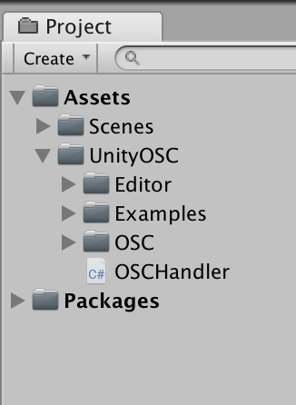
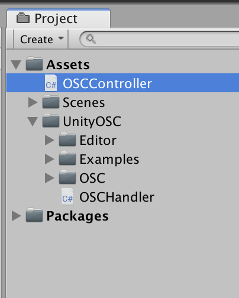
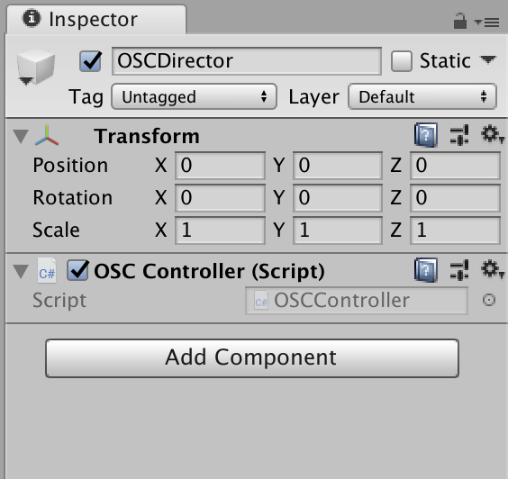
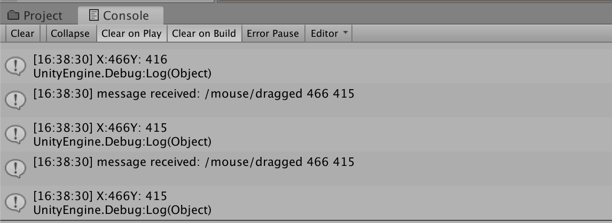
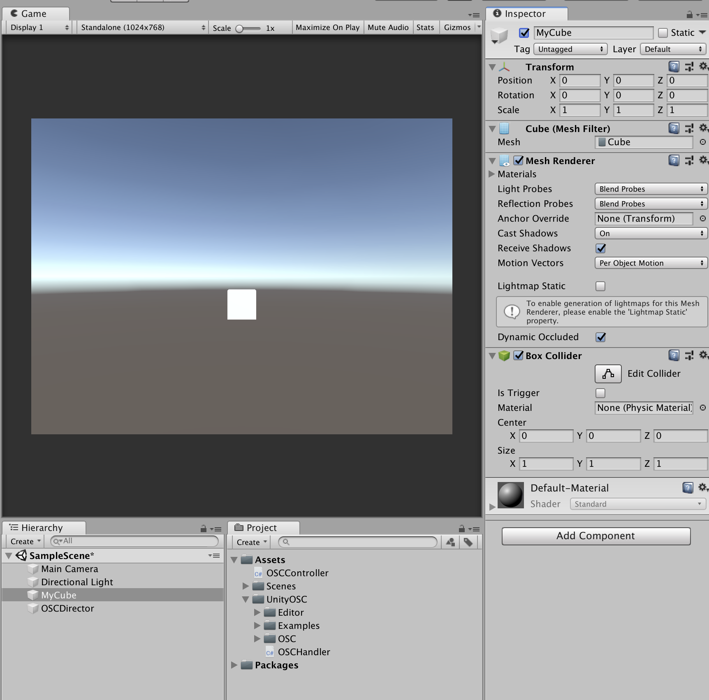
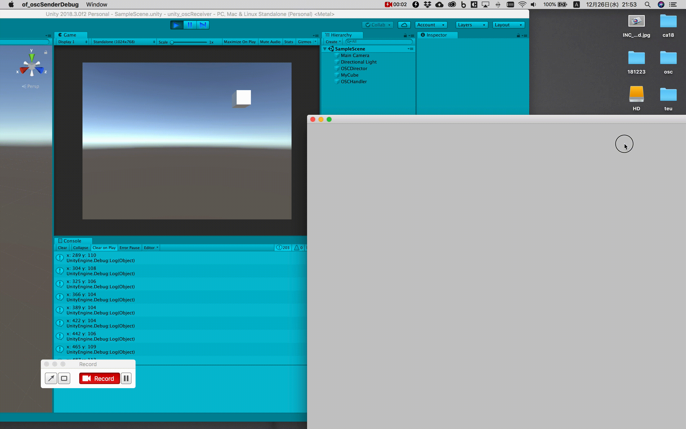

# oF/Unity連携

---

&nbsp;
&nbsp;

OSC通信でoFから値を送信してUnityで受信する。

&nbsp;
&nbsp;

## UnityOSC


UnityでOSC通信をするためのアドオン

[https://github.com/jorgegarcia/UnityOSC](https://github.com/jorgegarcia/UnityOSC) 

&nbsp;
&nbsp;

## ダウンロードからアドオンの追加

1 [UnityOSC](https://github.com/jorgegarcia/UnityOSC) をダウンロード

&nbsp;


2 `src`フォルダを`UnityOSC`と名称変更して、Unityプロジェクトの`Assets`フォルダにコピーする


 
 
&nbsp;
&nbsp;
 
## OSCHandler.cs


OSCHandler.csを編集。`Init()` 関数を以下の様に書き換える。

```
//OSCHandler.cs
	
public void Init()
{
    //Initialize OSC clients (transmitters)
    //Example:		
    //CreateClient("SuperCollider", IPAddress.Parse("127.0.0.1"), 5555);

    //Initialize OSC servers (listeners)
    //Example:

	//ポート番号の指定
    CreateServer("UnityReceiver", 9000);
}	
```	

__Unityが受信する場合はCreateServer()を使用。
Unityから送信する場合はCreateClient()を使用する。__

&nbsp;
&nbsp;

## OSCController.cs

新しくスクリプトファイル`OSCController.cs`ファイルを作成する。



`Hierarchy` パネルから `CreateEmpyt` でオブジェクトを作成して`OSCDirector` と命名する。`OSCController.cs`を **Add Componet**



&nbsp;
	
`OSCController.cs` ファイルを編集

```	
using System.Collections;
using System.Collections.Generic;
using UnityEngine;
using UnityOSC; //インポート

public class SimpleReceiver : MonoBehaviour
{
    //レシーバーのインスタンス
    private OSCReciever reciever;
    //受信用のポート番号
    public int port = 9000;
    //OSC識別のアドレス
    public string oscAddress = "/mouse/dragged";

    void Start()
    {
    	//レシーバーの生成
        reciever = new OSCReciever();
        //ポート番号でで受信開始
        reciever.Open(port);
    }

    
    void Update()
    {
    	//もしメッセージを受け取っていたら
        if (reciever.hasWaitingMessages())
        {
        	//メッセージを保存
            OSCMessage msg = reciever.getNextMessage();
            Debug.Log(string.Format("message received: {0} {1}", msg.Address, DataToString(msg.Data)));
			//OSC識別のアドレスと受信したアドレスが一致したら
            if (oscAddress == msg.Address)
            {
                Debug.Log("X:" + msg.Data[0] + "Y: " + msg.Data[1]);
            }
        }
    }

    //文字出力用の関数
    private string DataToString(List<object> data)
    {
        string buffer = "";
        for (int i = 0; i < data.Count; i++)
        {
            buffer += data[i].ToString() + " ";
        }
        buffer += "\n";
        return buffer;
    }
}
```



oFからのマウス座標を取得

* msg.Data[0]にX座標
* msg.Data[1]にY座標

&nbsp;
&nbsp;


## oFで画面をドラッグするとUnityで立方体が動く



Unityで3DオブジェクトCubeを作成。`MyCube`と命名する。


```
using System.Collections;
using System.Collections.Generic;
using UnityEngine;
using UnityOSC; //インポート

public class OSCController : MonoBehaviour
{
	//受信のインスタンス変数
    private OSCReciever reciever;
    //受信のポート番号
    public int port = 9000;
    //OSC識別のアドレス
    public string oscAddress = "/mouse/dragged";
    
    //ゲーム内の立方体
    GameObject cube;
    
    //座標
    Vector3 draggePosition; //oFからのマウス座標
    Vector3 screenToWorldPointPosition; //Unity座標に変換する
    Vector3 refrectPosition; //Y座標を反転する

    void Start()
    {
        //レシーバーの生成
        reciever = new OSCReciever();
        //ポート番号でで受信開始
        reciever.Open(port);
		
		//立方体の取得
        this.cube = GameObject.Find("MyCube");
    }

    
    void Update()
    {
        //もしメッセージを受け取っていたら
        if (reciever.hasWaitingMessages())
        {
            //メッセージを保存
            OSCMessage msg = reciever.getNextMessage();
            
            //OSC識別のアドレスと受信したアドレスが一致したら
            if (oscAddress == msg.Address)
            {
               //XY座標をfloat型にキャスト
                float d0 = float.Parse(msg.Data[0].ToString());
                float d1 = float.Parse(msg.Data[1].ToString());

                Debug.Log("x: " + d0 + " y: " + d1);

                //ドラッグの座標をVector3にセット
                draggePosition.Set(d0, d1, 10f);
                //画面座標をUnity座標に変換
                screenToWorldPointPosition = Camera.main.ScreenToWorldPoint(draggePosition);
                // Y座標が反転するので-1をかける
                refrectPosition.Set(screenToWorldPointPosition.x, screenToWorldPointPosition.y * (-1), screenToWorldPointPosition.z);
                // MyCubeに座標をセット
                this.cube.transform.position = refrectPosition;
            }
        }
    }
}
```




[完成版](https://github.com/yonekura907/dh18au_of/blob/master/190710/of_unity_osc.zip)


