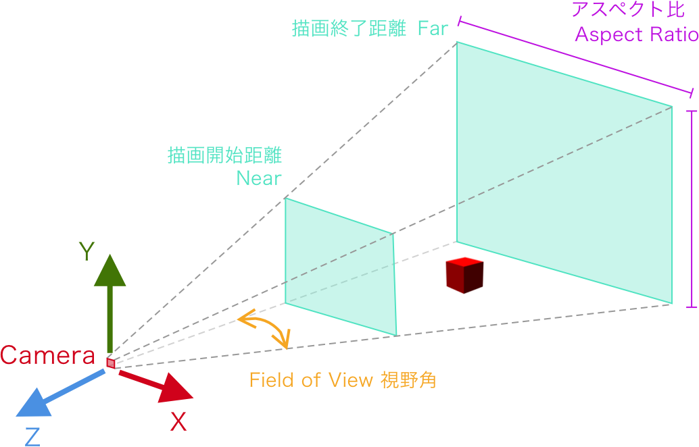
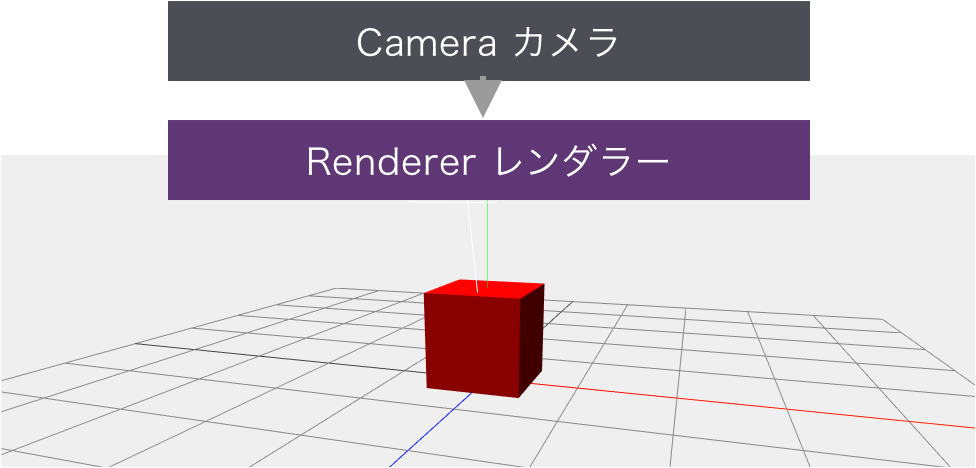
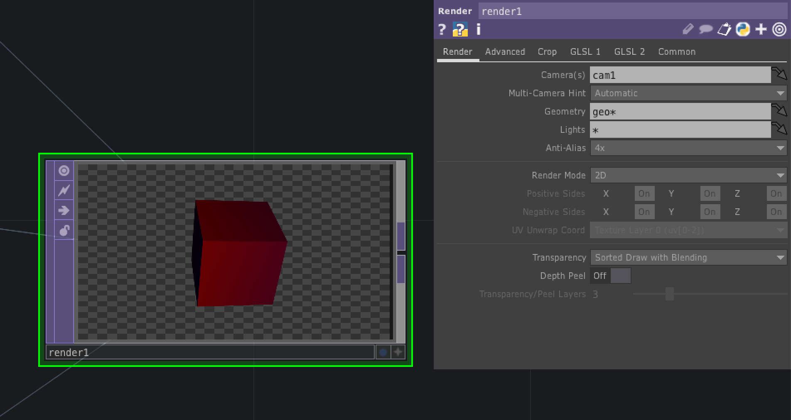
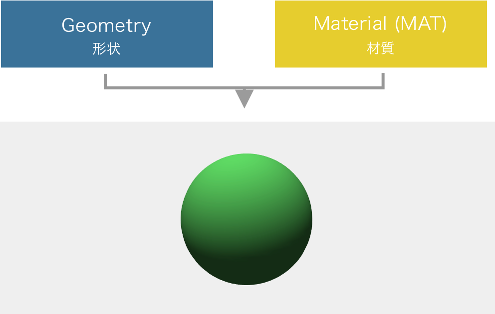

# 3D

---

&nbsp;

## 3D空間を生成するための仕組み

* カメラ
* レンダリング

&nbsp;
&nbsp;

## カメラ Camera

### Projection　投影方法

* 透視投影 PerspectiveCamera
* 正投影 OrthographicCamera

&nbsp;

### 透視投影(PerspectiveCamera)

&nbsp;

* FOV (Field of View) 視野角 60~90度が多い
* Near カメラから視体積の手前までの距離
* Far カメラから視体積の奥までの距離

&nbsp;
&nbsp;

## レンダラー Renderer

仮想的な3次元空間を 2次元ディスプレイに描画することをレンダリングと呼ぶ。TouchDesignerでは `Render TOP` で生成される。

&nbsp;

&nbsp;
&nbsp;

## 3Dオブジェクト

3Dオブジェクトは形状と材質から描画が生成される。形状の選択は`SOP`を使用し、表面の質感や色は`MAT`を使用する。

