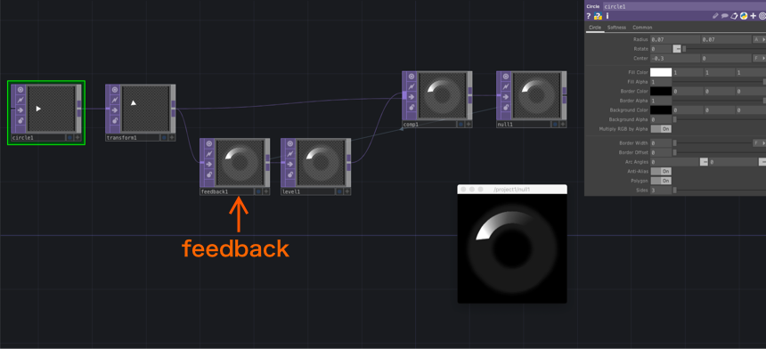
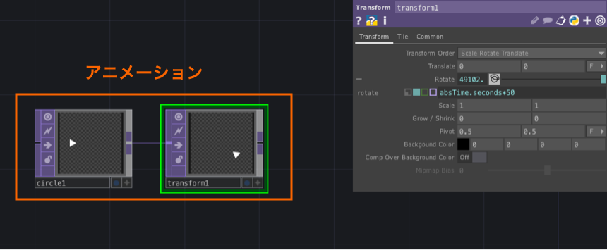
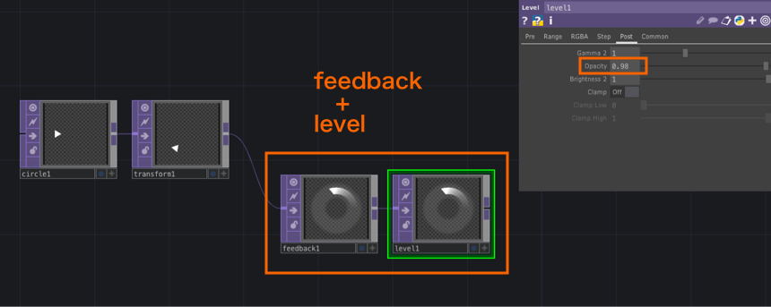
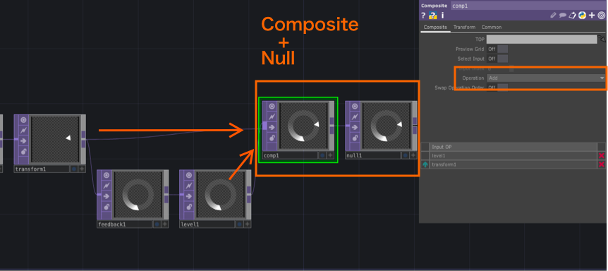
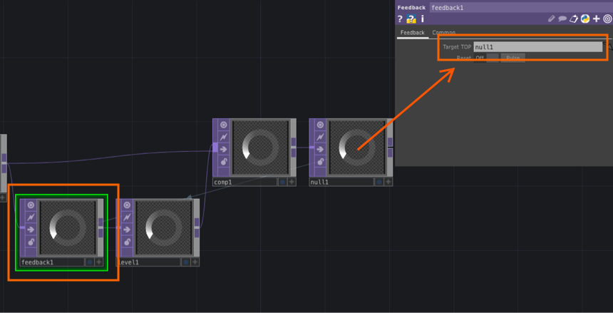
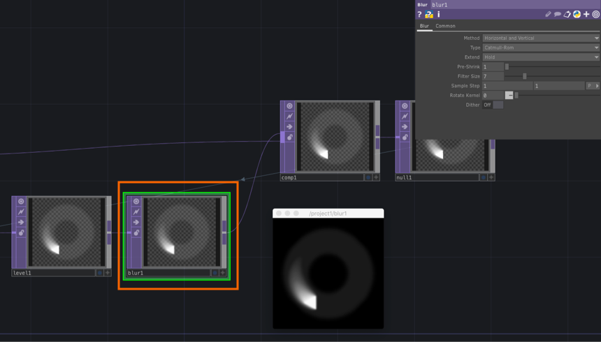

# FeedbackTOPを使った残像表現

&nbsp;
&nbsp;

&nbsp;
&nbsp;

## 1 アニメーションを組む

&nbsp;
&nbsp;

## 2 FeedbackとLevel

* `feedbackTOP`は今は何も設定しない
* `levelTOP`の`Post`から`Opacity`を`0.98`程下げる

&nbsp;
&nbsp;

## 3 CompositeとNull

* `lelevTOP`とアニメーションで作った`TransformTOP`から`CompositeTOP`をつなげる。
* `CompositeTOP `の`Operation`はいろいろ試せるが一旦`Add`にする

&nbsp;
&nbsp;

## 4 FeedbackとNull

* `feedbackTOP`のパラメーター`Target TOP`に最後のOP`null1`をドラッグする（直接OP名`null1`と入力しても良い）

* ここで残像表現が出てくる

&nbsp;
&nbsp;

## 5 Blurで発光させる

* `levelTOP`と`CompositeTOP`の間に`blurTOP`を挟むと発光するような表現になる場合がある

&nbsp;
&nbsp;
&nbsp;
&nbsp;

---

## 参考

[Matthew Ragan | Playing with Feedback](https://matthewragan.com/2015/03/29/thp-494-598-playing-with-feedback-touchdesigner/)