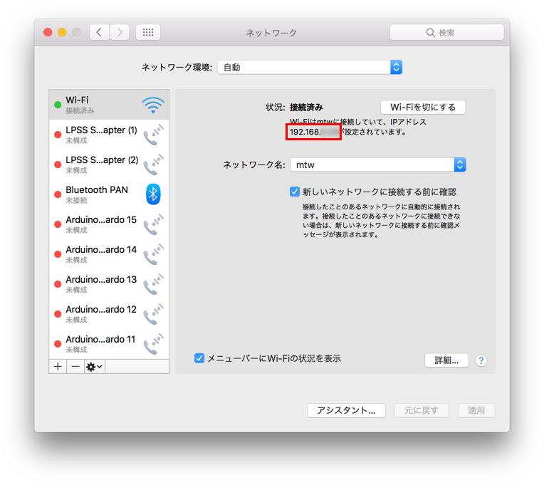
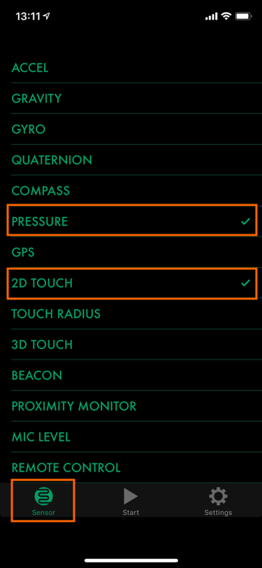
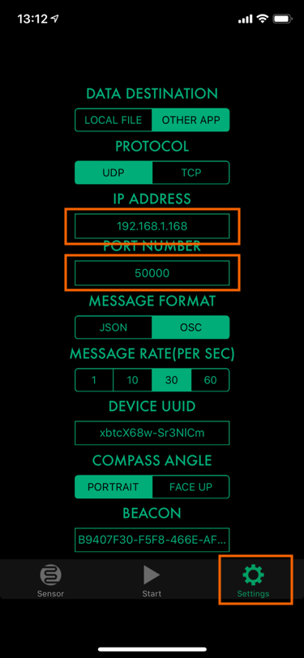
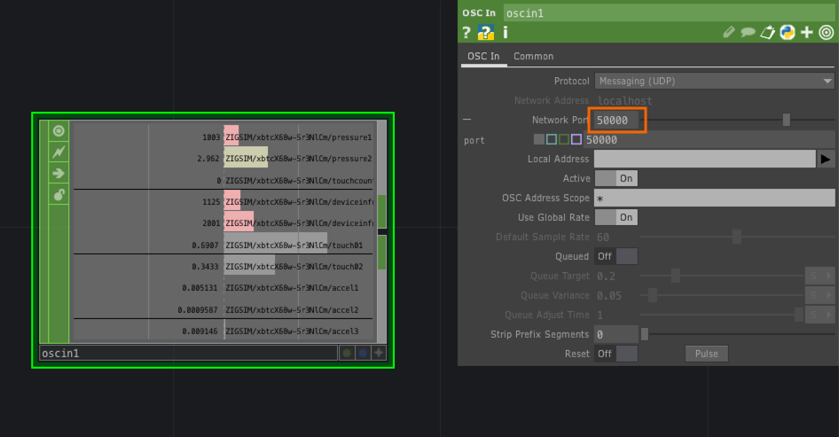
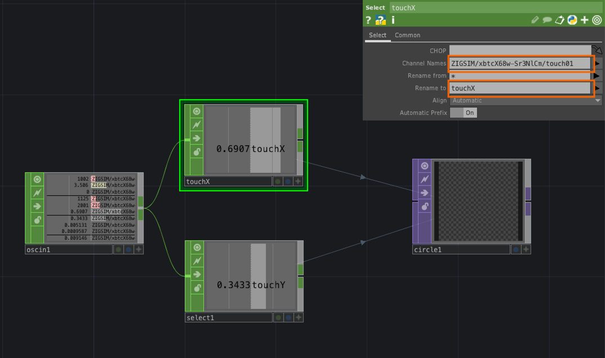

# OSC

## OSCとは

OpenSound Control（OSC）とは、電子楽器（特にシンセサイザー）やコンピュータなどの機器において音楽演奏データをネットワーク経由でリアルタイムに共有するための通信プロトコルである。([Wikipedia](https://ja.wikipedia.org/wiki/OpenSound_Control))

対応アプリケーションは多数あり、リアルタイムに同期できる。

&nbsp;
&nbsp;

## OSCの設定

#### ネットワークアドレスの確認

&nbsp;
&nbsp;

## OSCの送信

### ZIG SIM のインストール

[Zig プロジェクト](https://zig-project.com/)

スマホアプリからOSC通信のテストができるアプリ

　

&nbsp;
&nbsp;

### ZIG SIM の設定

* タブバーの`Sensor`を選択
* `PRESSURE`と`2D TOUCH`を選ぶ 

&nbsp;

* タブバーの`Settings`を選択
* `IP ADDRESS`にネットワークアドレスを入力
* `PORT NUMBER`を確認する 

&nbsp;

* タブバーの`Start`を選択
* 画面内をドラッグする

## OSCの受信

### OSC in CHOPを配置

* `Network Port`に ポート番号 `50000` を入力

&nbsp;

* `Channel Names`からに `touch01`を選択
* `Rename`に `touchX`と入力

&nbsp;
&nbsp;