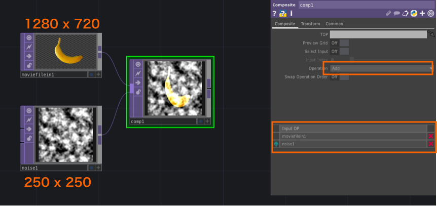
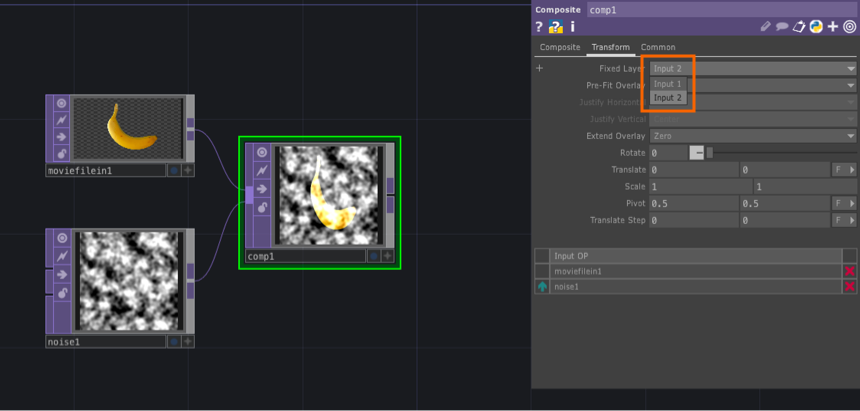
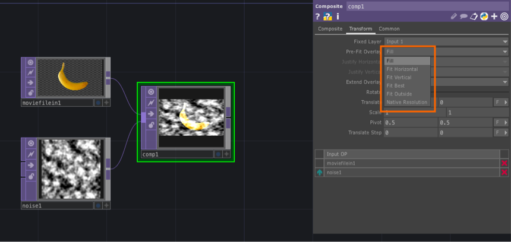
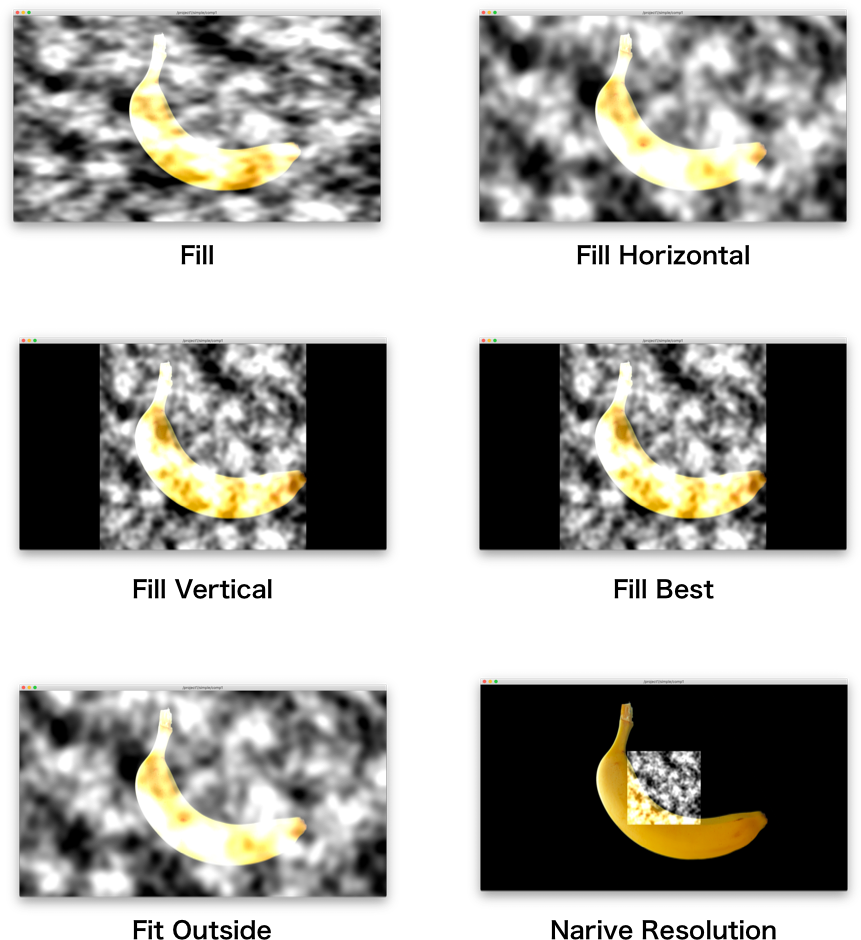

# 解像度

TouchDesignerでは異なる解像度の組み合わせで作品を作る際に調整が必要になる。

## 重ね順

矢印をクリックすると入れ替えることができる

&nbsp;
&nbsp;

## Fixed Layer

基準となるレイヤーを選択する

予め同じにしても良い

&nbsp;
&nbsp;

## Pre-Fit Overlay

オーバーレイで重ねる際の比率を選ぶことができる

* Fill
	* ベースレイヤーの画面サイズに合わせる
* Fill Horizontal
	* 水平方向をベースレイヤーの画面にサイズに合わせて拡大
* Fill Vertical
	* 垂直方向をベースレイヤーの画面にサイズに合わせて拡大
* Fit Best
	* 両方を考慮してフィットさせる
* Fit Outside
	* 縦横比の短い画面に合わせてアスペクト比をそのままに拡大
* Narive Resolution
	* 両方の解像度に合わせて拡大

&nbsp;
&nbsp;

