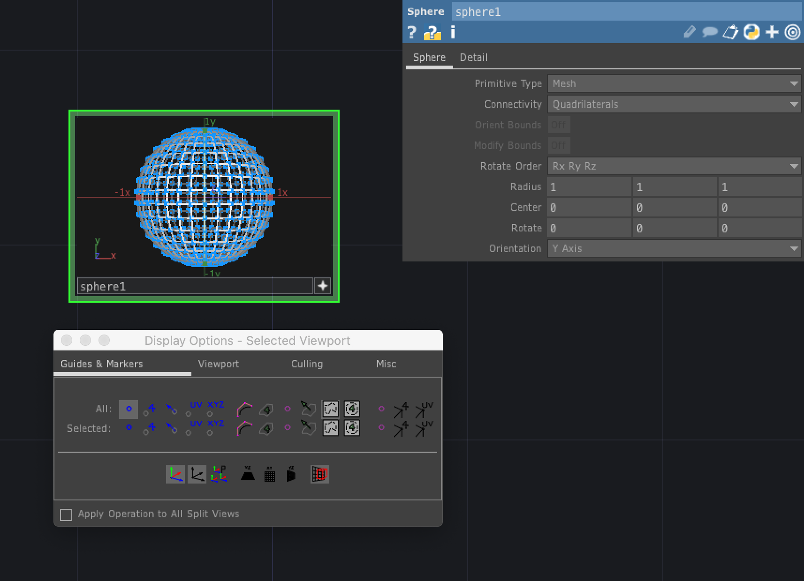
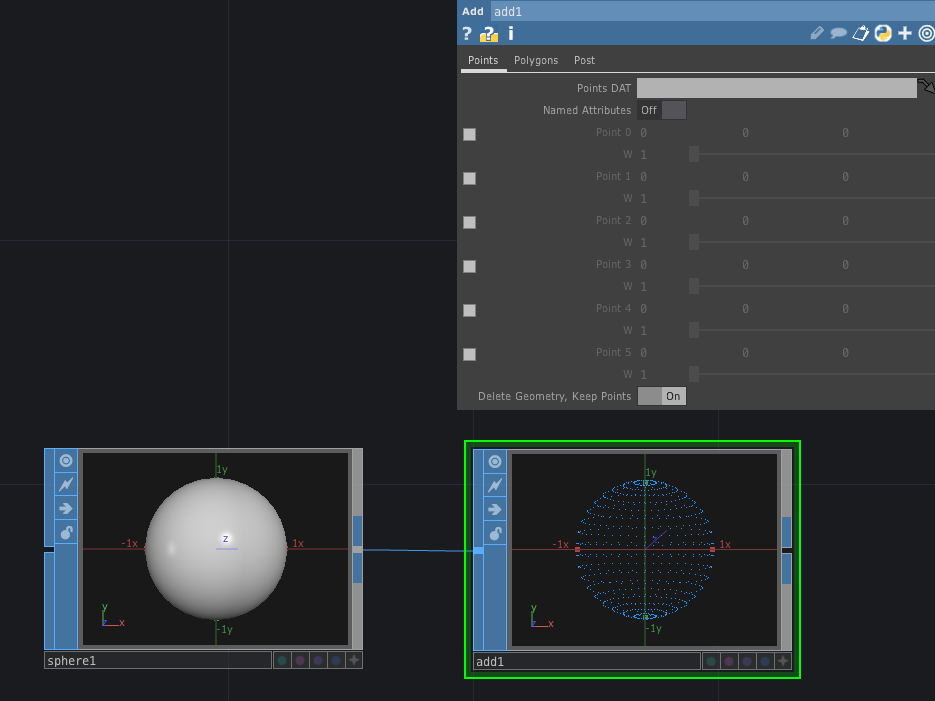
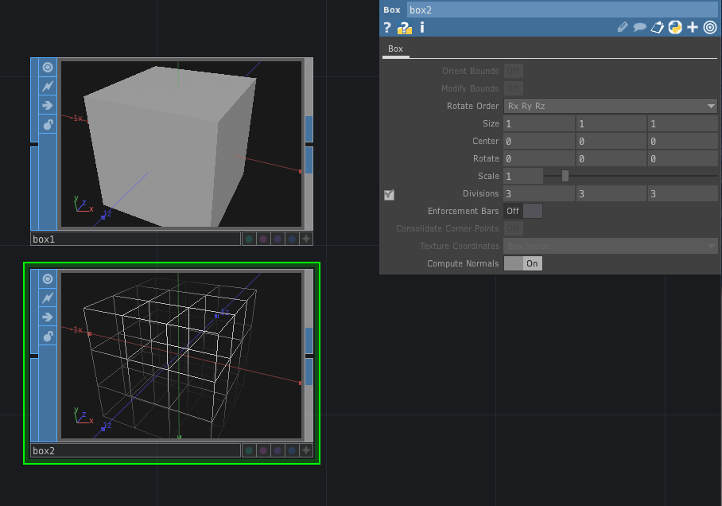
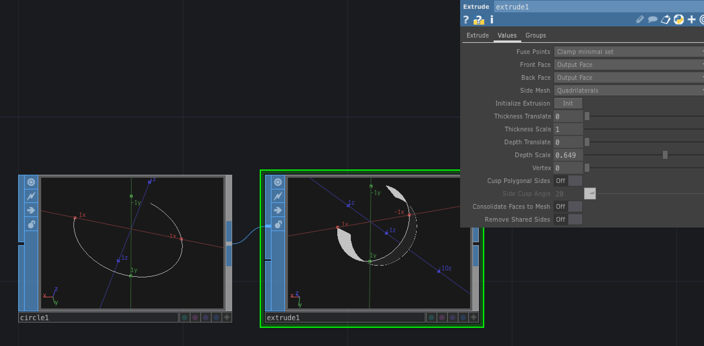
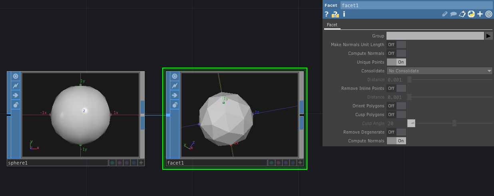
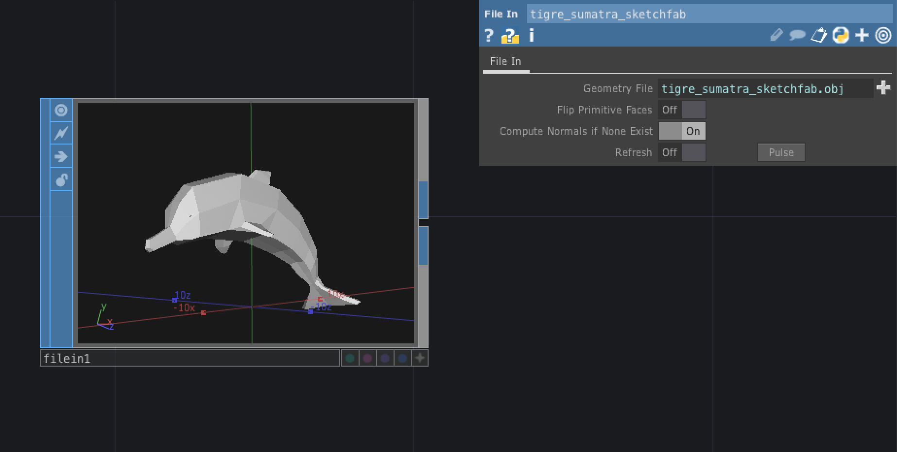
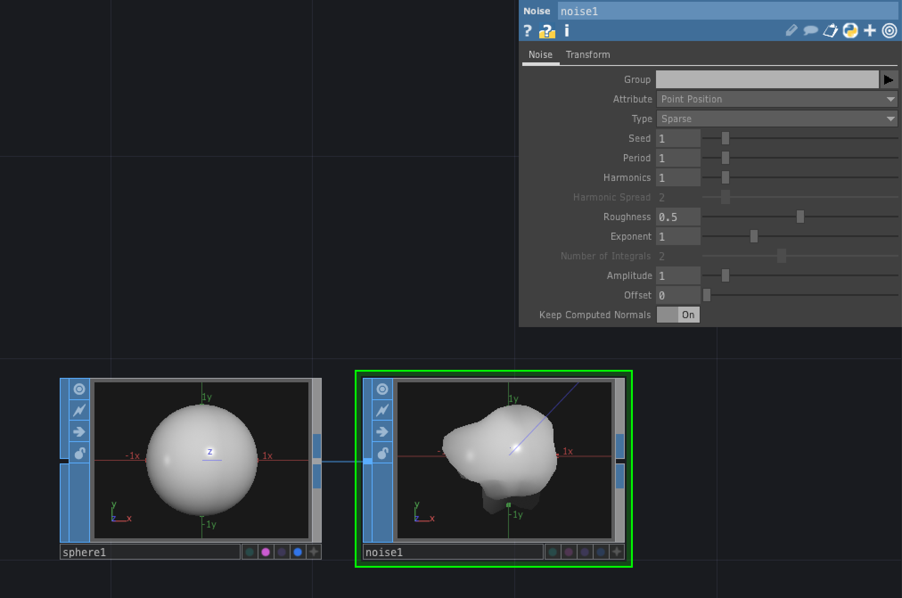
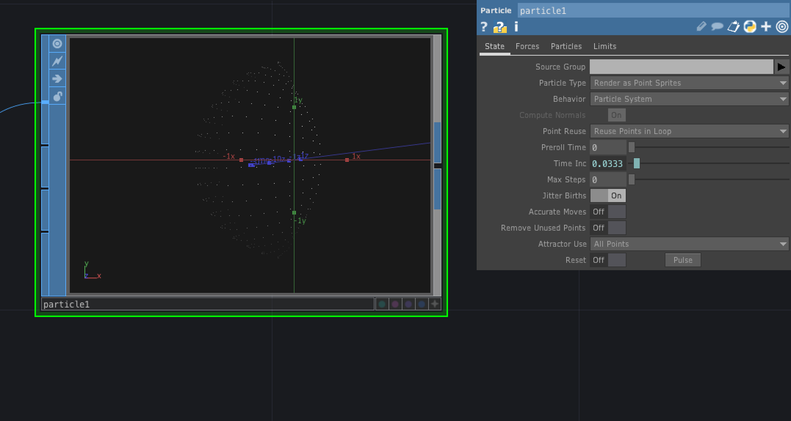
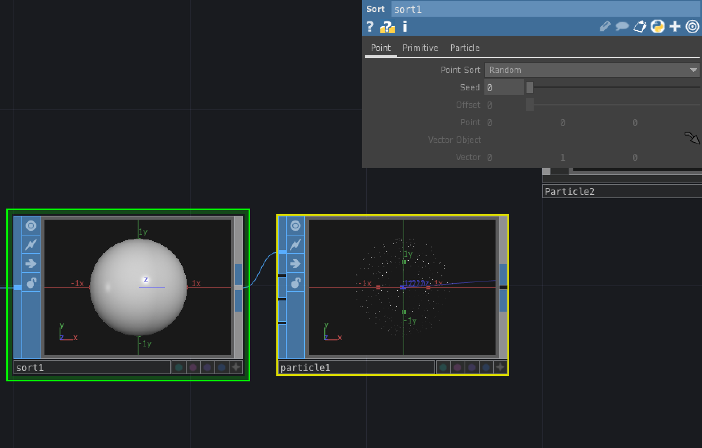
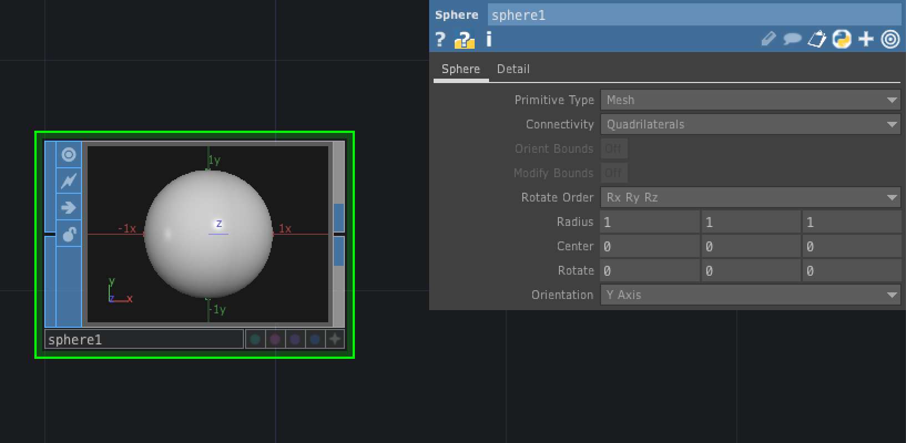

# SOP (Surface Operator)

3Dオブジェクトを扱うオペレータ

&nbsp;
&nbsp;

## 公式リファレンス
[SOP - Surface Operators](https://docs.derivative.ca/SOP)

&nbsp;
&nbsp;

---

# SOP 基本操作

* [+] で`ViewActive`
* [W]でワイヤーフレーム

#### Display Option
右クリックで`Display Option` もしくは [P]

&nbsp;
&nbsp;

---

# 0P

## Add

頂点からポリゴンを作成する

* `Delete Geometry, Keep Point` を `On` にすると頂点のみの表示になる

&nbsp;
&nbsp;

## Blend

複数のジオメトリをブレンドする

- `Carve` トリミング
- `Copy`　複製
  - `Translate` で座標をずらす
- `Merge` 描画をまとめる
- `Grid`

&nbsp;
&nbsp;

## Box

立方体

* `Divisions` で分割数を変更

&nbsp;
&nbsp;

## Extrude SOP

押し出し

* `Depth Scale` で押し出す

&nbsp;
&nbsp;

## Facet

表面の平滑化

- `Unique Points`　共有
- `Compute Nomals` 反射

`Sphere`を`Polygon`にして、`Unique Points`と`Compute Nomals`を`On`にする

## Filein

外部3Dデータの読み込み

&nbsp;
&nbsp;

## Grid

* `Compute Nomarls` 法線

&nbsp;
&nbsp;

## Merge

複数のジオメトリの結合

&nbsp;
&nbsp;

## Noise

ノイズ

&nbsp;
&nbsp;

## Particle SOP

粒子パーティクルの生成

* State
	* Particle Type　粒子の形状　`Render Point Lines`は線、`Render Point Sprites`は点
	* Compute Normals　法線情報
	* Remove Unused Points 粒子を削除するかどうか

* Forces
	* External Force 粒子の進む向き
	* Wind 粒子の向きに加速度を加える
	* Turbulence 粒子の乱れ、乱気流の様な動き
	* Turb Period　乱流が変化する細かさ。
	* Seed ランダムのシード値

* Particles
	* Drag　空気抵抗
	* Birth　毎秒生まれる粒子の数
	* Life Expect 粒子が消えるまでの秒数
	* Life Variance　粒子が消えるまでの時間のゆらぎ
* Limits
	* Hit Behavior 衝突　`Bounce on Contact`　で　パーティクルが跳ね返る
	* Gain Tangent　跳返りの程度
	* Gain Normal　跳ね返りの法線方向	 

&nbsp;
&nbsp;

## Sort SOP

ソート

`Point Sort`を`Random`でパーティクルをランダムに生成できる

&nbsp;
&nbsp;

## Sphere
球体

* `Primitive Type`
	* Primitive 頂点 (x, y, z) を定義して繋いだ状態
	* Polygon　三角形ポリゴン
	* Mesh 四角形ポリゴン

&nbsp;
&nbsp;

## Transform SOP

座標やスーケル・回転を調整

&nbsp;
&nbsp;
